# Cognee Architecture Documentation

> **Comprehensive architectural visualizations for Cognee - Memory Layer for AI Agents**

This document provides detailed architectural diagrams explaining the Cognee system from high-level concepts down to low-level implementation details. Each diagram focuses on a specific aspect of the architecture to provide clarity and understanding.

## Table of Contents

1. [High-Level Architecture Overview](#1-high-level-architecture-overview)
2. [Core Workflow - ECL Pipeline](#2-core-workflow---ecl-pipeline)
3. [System Components Architecture](#3-system-components-architecture)
4. [Infrastructure Layer](#4-infrastructure-layer)
5. [Database Architecture](#5-database-architecture)
6. [API Layer Architecture](#6-api-layer-architecture)
7. [Pipeline Processing System](#7-pipeline-processing-system)
8. [Module Dependencies](#8-module-dependencies)
9. [Data Flow - Add Operation](#9-data-flow---add-operation)
10. [Data Flow - Cognify Operation](#10-data-flow---cognify-operation)
11. [Data Flow - Memify Operation](#11-data-flow---memify-operation)
12. [Data Flow - Search Operation](#12-data-flow---search-operation)
13. [LLM Integration Architecture](#13-llm-integration-architecture)
14. [Vector Database Integration](#14-vector-database-integration)
15. [Graph Database Integration](#15-graph-database-integration)
16. [Task System Architecture](#16-task-system-architecture)
17. [Chunking Strategy](#17-chunking-strategy)
18. [Retrieval System](#18-retrieval-system)
19. [Knowledge Graph Construction](#19-knowledge-graph-construction)
20. [Authentication & Permissions](#20-authentication--permissions)
21. [Configuration Management](#21-configuration-management)
22. [Observability & Monitoring](#22-observability--monitoring)
23. [Deployment Architecture](#23-deployment-architecture)

---

## 1. High-Level Architecture Overview

The highest-level view of Cognee showing the main conceptual components and their relationships.

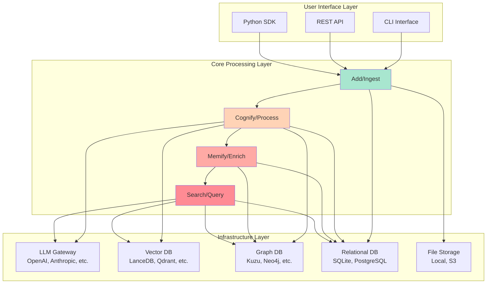

**Description:** This diagram shows how Cognee transforms unstructured data into an intelligent knowledge graph through the ECL (Extract, Cognify, Load) pipeline. Users interact through CLI, REST API, or Python SDK to add data, process it into knowledge graphs, enrich with memory algorithms, and search for insights.

---

## 2. Core Workflow - ECL Pipeline

The Extract-Cognify-Load workflow that forms the heart of Cognee's processing.

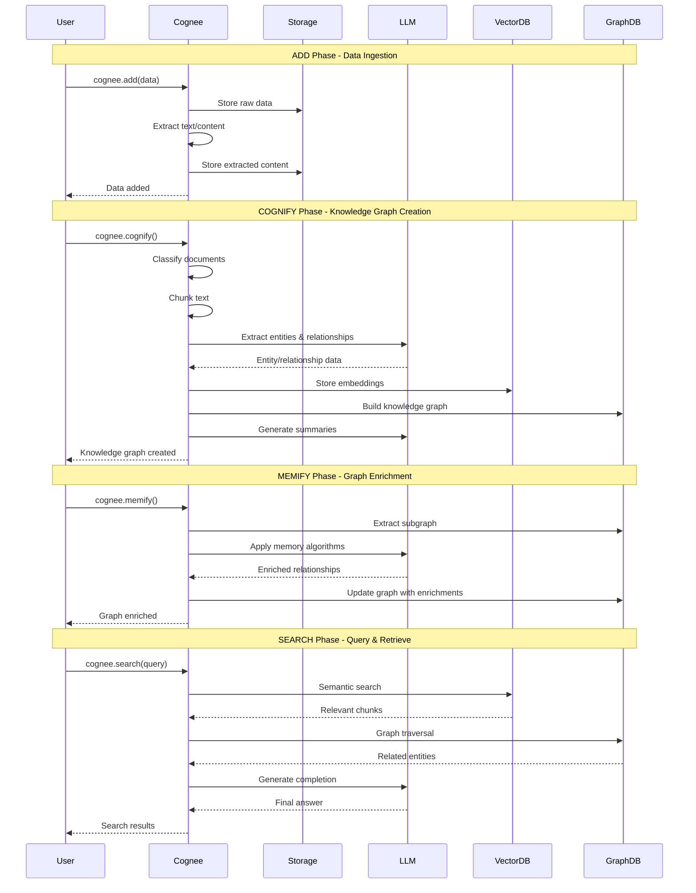

**Description:** This sequence diagram illustrates the complete lifecycle of data through Cognee, from ingestion to intelligent query responses, showing how each phase interacts with different infrastructure components.

---

## 3. System Components Architecture

Detailed breakdown of all major system components and their relationships.

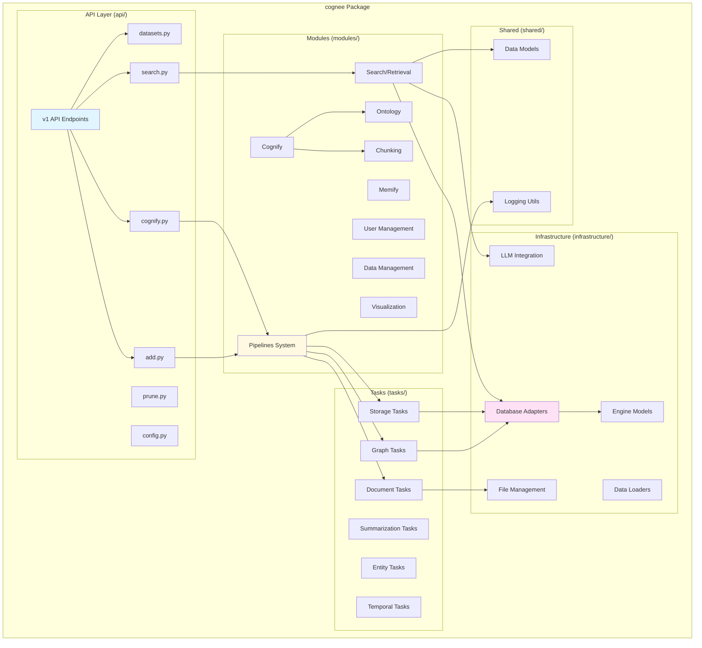

**Description:** This diagram shows the modular architecture of Cognee, with clear separation between API endpoints, core modules, infrastructure services, task implementations, and shared utilities.

---

## 4. Infrastructure Layer

Deep dive into the infrastructure components that power Cognee.

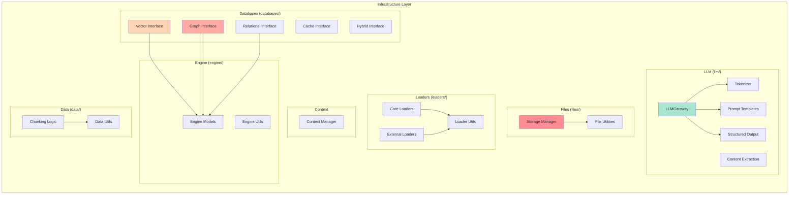

**Description:** The infrastructure layer provides abstracted interfaces to external services like LLMs, databases, and storage systems, allowing Cognee to be provider-agnostic and easily configurable.

---

## 5. Database Architecture

Multi-database architecture supporting vector, graph, and relational storage.

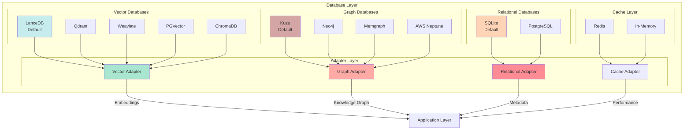

**Description:** Cognee uses a multi-database strategy where vector databases store embeddings for semantic search, graph databases store knowledge relationships, and relational databases manage metadata and user information.

---

## 6. API Layer Architecture

RESTful API structure and endpoint organization.

```mermaid
graph TB
    subgraph "API v1 Structure"
        ROOT[/api/v1/]
        
        subgraph "Core Operations"
            ADD[/add<br/>POST - Add data]
            COGNIFY[/cognify<br/>POST - Process data]
            SEARCH[/search<br/>POST - Query]
            PRUNE[/prune<br/>DELETE - Clean]
        end
        
        subgraph "Resource Management"
            DATASETS[/datasets<br/>GET, POST, DELETE]
            CONFIG[/config<br/>GET, PUT]
            UPDATE[/update<br/>PUT]
        end
        
        subgraph "Advanced Features"
            VISUALIZE[/visualize<br/>GET - Graph viz]
            RESPONSES[/responses<br/>Tool responses]
            CLOUD[/cloud<br/>Cloud sync]
        end
        
        subgraph "System"
            HEALTH[/health<br/>GET - Health check]
            UI[/ui<br/>Start UI server]
        end
    end
    
    ROOT --> ADD
    ROOT --> COGNIFY
    ROOT --> SEARCH
    ROOT --> PRUNE
    ROOT --> DATASETS
    ROOT --> CONFIG
    ROOT --> UPDATE
    ROOT --> VISUALIZE
    ROOT --> RESPONSES
    ROOT --> CLOUD
    ROOT --> HEALTH
    ROOT --> UI
    
    ADD --> |Uses| PIPELINE_SVC[Pipeline Service]
    COGNIFY --> |Uses| PIPELINE_SVC
    SEARCH --> |Uses| SEARCH_SVC[Search Service]
    DATASETS --> |Uses| DATA_SVC[Data Service]
    
    PIPELINE_SVC --> TASKS[Task Execution]
    SEARCH_SVC --> RETRIEVERS[Retrievers]
    DATA_SVC --> DB[Database]
    
    style ADD fill:#a8e6cf
    style COGNIFY fill:#ffd3b6
    style SEARCH fill:#ff8b94
    style DATASETS fill:#c7ecee
```

**Description:** The API layer follows RESTful conventions and provides a clean interface for all Cognee operations, from data ingestion to search and visualization.

---

## 7. Pipeline Processing System

The pipeline system orchestrates task execution and data flow.

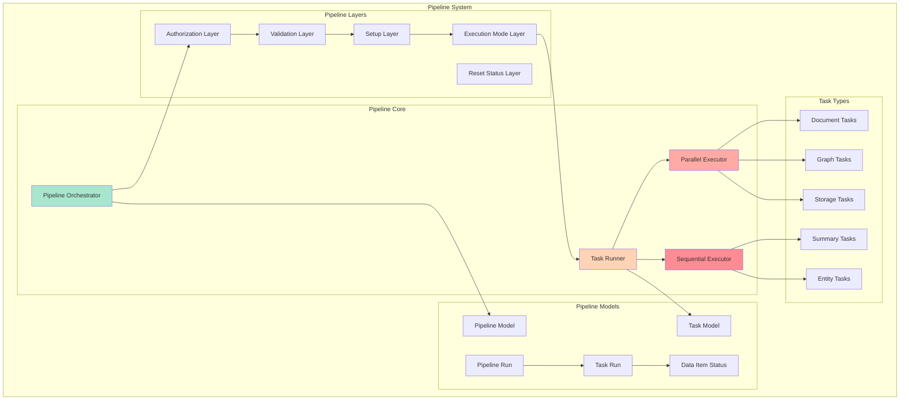

**Description:** The pipeline system provides flexible task orchestration with support for parallel and sequential execution, comprehensive status tracking, and error handling.

---

## 8. Module Dependencies

Dependencies between major modules showing information flow.

```mermaid
graph LR
    subgraph "User-Facing Modules"
        API_MOD[API Module]
        CLI_MOD[CLI Module]
    end
    
    subgraph "Core Processing Modules"
        PIPELINE_MOD[Pipelines Module]
        COGNIFY_MODUL[Cognify Module]
        MEMIFY_MODUL[Memify Module]
        SEARCH_MODUL[Search Module]
    end
    
    subgraph "Feature Modules"
        CHUNKING_MOD[Chunking Module]
        RETRIEVAL_MOD[Retrieval Module]
        ONTOLOGY_MOD[Ontology Module]
        USERS_MOD[Users Module]
        DATA_MOD[Data Module]
        STORAGE_MOD[Storage Module]
        VISUALIZATION_MOD[Visualization Module]
        OBSERVABILITY_MOD[Observability Module]
    end
    
    subgraph "Infrastructure Modules"
        LLM_MOD[LLM Module]
        DB_MOD[Database Module]
        FILE_MOD[Files Module]
        LOADER_MOD[Loaders Module]
        ENGINE_MOD[Engine Module]
    end
    
    API_MOD --> PIPELINE_MOD
    CLI_MOD --> PIPELINE_MOD
    
    PIPELINE_MOD --> COGNIFY_MODUL
    PIPELINE_MOD --> MEMIFY_MODUL
    COGNIFY_MODUL --> CHUNKING_MOD
    COGNIFY_MODUL --> ONTOLOGY_MOD
    MEMIFY_MODUL --> RETRIEVAL_MOD
    SEARCH_MODUL --> RETRIEVAL_MOD
    
    COGNIFY_MODUL --> LLM_MOD
    SEARCH_MODUL --> LLM_MOD
    MEMIFY_MODUL --> LLM_MOD
    
    RETRIEVAL_MOD --> DB_MOD
    CHUNKING_MOD --> DB_MOD
    STORAGE_MOD --> DB_MOD
    
    PIPELINE_MOD --> USERS_MOD
    PIPELINE_MOD --> DATA_MOD
    DATA_MOD --> FILE_MOD
    
    DB_MOD --> ENGINE_MOD
    
    PIPELINE_MOD --> OBSERVABILITY_MOD
    SEARCH_MODUL --> VISUALIZATION_MOD
    
    style API_MOD fill:#e1f5ff
    style PIPELINE_MOD fill:#fff9e1
    style LLM_MOD fill:#ffe1f5
    style DB_MOD fill:#e1ffe1
```

**Description:** This dependency graph shows how modules interact, with clear separation of concerns between user interfaces, processing logic, feature modules, and infrastructure.

---

## 9. Data Flow - Add Operation

Detailed data flow for the add/ingestion operation.

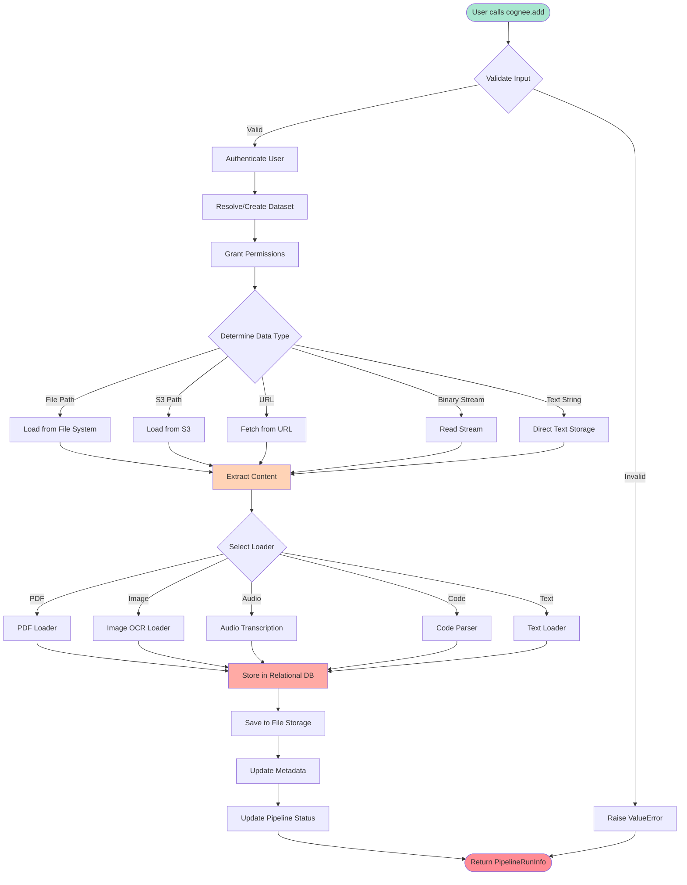

**Description:** The add operation handles multiple data formats, automatically selecting the appropriate loader and extraction strategy, then storing the content with proper metadata and permissions.

---

## 10. Data Flow - Cognify Operation

Detailed data flow for the cognify/processing operation.

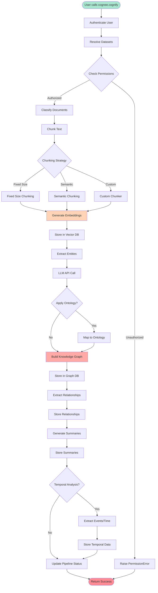

**Description:** The cognify operation transforms raw text into a structured knowledge graph through chunking, entity extraction, relationship detection, and semantic indexing.

---

## 11. Data Flow - Memify Operation

Detailed data flow for the memify/enrichment operation.

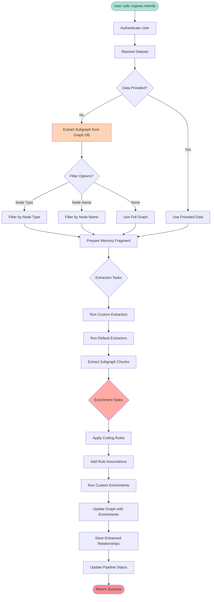

**Description:** The memify operation enriches existing knowledge graphs with memory algorithms, rules, and custom processing to enhance the graph's intelligence and reasoning capabilities.

---

## 12. Data Flow - Search Operation

Detailed data flow for the search/query operation.

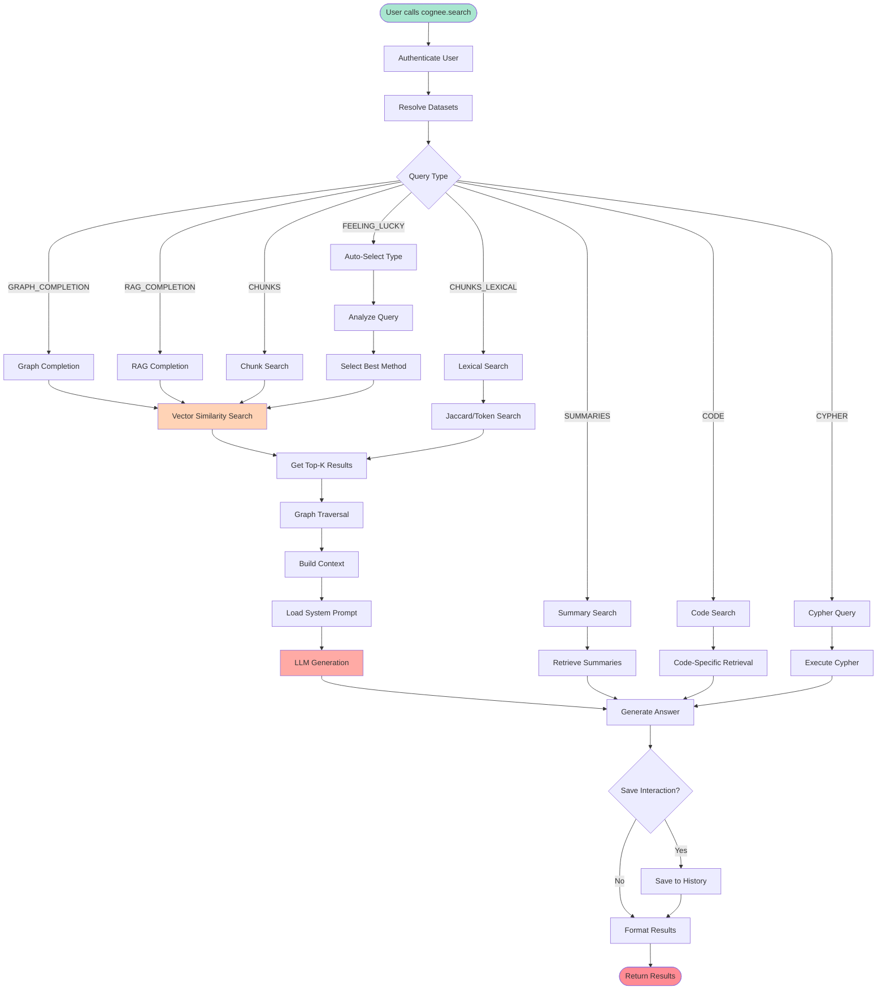

**Description:** The search operation provides multiple retrieval strategies, from simple vector search to complex graph traversal with LLM-powered reasoning, automatically adapting to the query type.

---

## 13. LLM Integration Architecture

How Cognee integrates with various LLM providers.

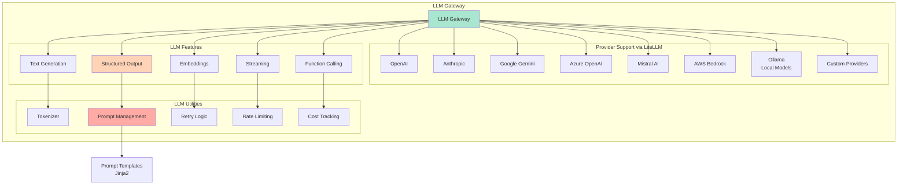

**Description:** The LLM Gateway provides a unified interface to multiple LLM providers through LiteLLM, supporting advanced features like structured outputs, streaming, and function calling while handling rate limiting and retries.

---

## 14. Vector Database Integration

Vector database architecture for semantic search.

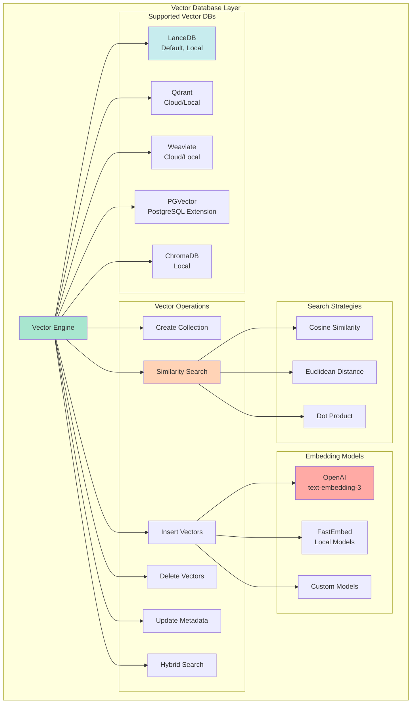

**Description:** Vector databases store embeddings for semantic search, with LanceDB as the default for its efficiency and local-first approach. Multiple providers are supported for different deployment scenarios.

---

## 15. Graph Database Integration

Graph database architecture for knowledge representation.

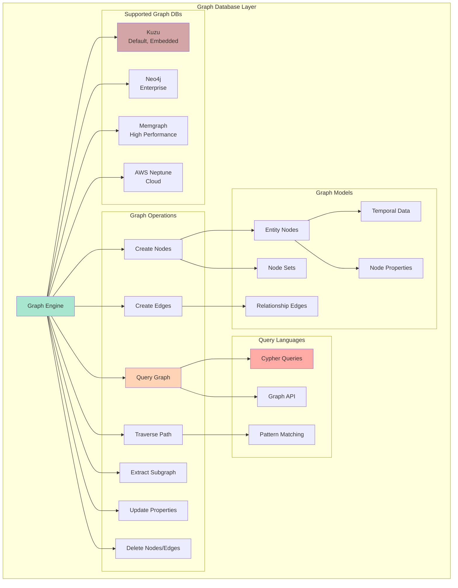

**Description:** Graph databases store the knowledge graph structure with nodes representing entities and edges representing relationships. Kuzu is the default for its embedded nature and high performance.

---

## 16. Task System Architecture

Task-based processing architecture for modular operations.

```mermaid
graph TB
    subgraph "Task System"
        TASK_BASE[Task Base Class]
        
        subgraph "Document Tasks"
            CLASSIFY_DOC[Classify Documents]
            EXTRACT_CHUNKS[Extract Chunks]
            CHECK_PERMS[Check Permissions]
        end
        
        subgraph "Graph Tasks"
            EXTRACT_GRAPH[Extract Graph from Data]
            BUILD_GRAPH[Build Knowledge Graph]
            UPDATE_GRAPH[Update Graph]
        end
        
        subgraph "Storage Tasks"
            ADD_DATA_POINTS[Add Data Points]
            STORE_EMBED[Store Embeddings]
            SAVE_META[Save Metadata]
        end
        
        subgraph "Summarization Tasks"
            SUMMARIZE_TEXT[Summarize Text]
            MULTI_LEVEL[Multi-Level Summaries]
            STORE_SUMMARIES[Store Summaries]
        end
        
        subgraph "Entity Tasks"
            EXTRACT_ENTITIES[Extract Entities]
            ENTITY_RESOLVE[Entity Resolution]
            ENTITY_LINK[Entity Linking]
        end
        
        subgraph "Temporal Tasks"
            EXTRACT_EVENTS[Extract Events]
            EXTRACT_TIME[Extract Timestamps]
            BUILD_TEMPORAL[Build Temporal Graph]
        end
        
        subgraph "Code Tasks"
            PARSE_CODE[Parse Code]
            EXTRACT_SYMBOLS[Extract Symbols]
            BUILD_CODE_GRAPH[Build Code Graph]
        end
        
        subgraph "Memify Tasks"
            EXTRACT_SUBGRAPH[Extract Subgraph Chunks]
            ADD_RULES[Add Rule Associations]
            ENRICH_GRAPH[Enrich Graph]
        end
    end
    
    TASK_BASE --> CLASSIFY_DOC
    TASK_BASE --> EXTRACT_CHUNKS
    TASK_BASE --> CHECK_PERMS
    TASK_BASE --> EXTRACT_GRAPH
    TASK_BASE --> BUILD_GRAPH
    TASK_BASE --> UPDATE_GRAPH
    TASK_BASE --> ADD_DATA_POINTS
    TASK_BASE --> STORE_EMBED
    TASK_BASE --> SAVE_META
    TASK_BASE --> SUMMARIZE_TEXT
    TASK_BASE --> MULTI_LEVEL
    TASK_BASE --> STORE_SUMMARIES
    TASK_BASE --> EXTRACT_ENTITIES
    TASK_BASE --> ENTITY_RESOLVE
    TASK_BASE --> ENTITY_LINK
    TASK_BASE --> EXTRACT_EVENTS
    TASK_BASE --> EXTRACT_TIME
    TASK_BASE --> BUILD_TEMPORAL
    TASK_BASE --> PARSE_CODE
    TASK_BASE --> EXTRACT_SYMBOLS
    TASK_BASE --> BUILD_CODE_GRAPH
    TASK_BASE --> EXTRACT_SUBGRAPH
    TASK_BASE --> ADD_RULES
    TASK_BASE --> ENRICH_GRAPH
    
    style TASK_BASE fill:#a8e6cf
    style EXTRACT_GRAPH fill:#ffd3b6
    style SUMMARIZE_TEXT fill:#ffaaa5
    style EXTRACT_ENTITIES fill:#ff8b94
```

**Description:** Tasks are modular processing units that can be composed into pipelines. Each task handles a specific operation in the ECL workflow, from document classification to graph enrichment.

---

## 17. Chunking Strategy

Text chunking approaches for optimal processing.

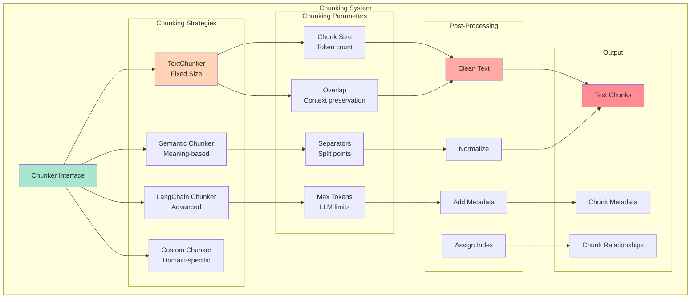

**Description:** Chunking breaks down large documents into manageable pieces for LLM processing. Multiple strategies are available, from simple fixed-size splitting to sophisticated semantic chunking that preserves meaning.

---

## 18. Retrieval System

Multi-modal retrieval system for information access.

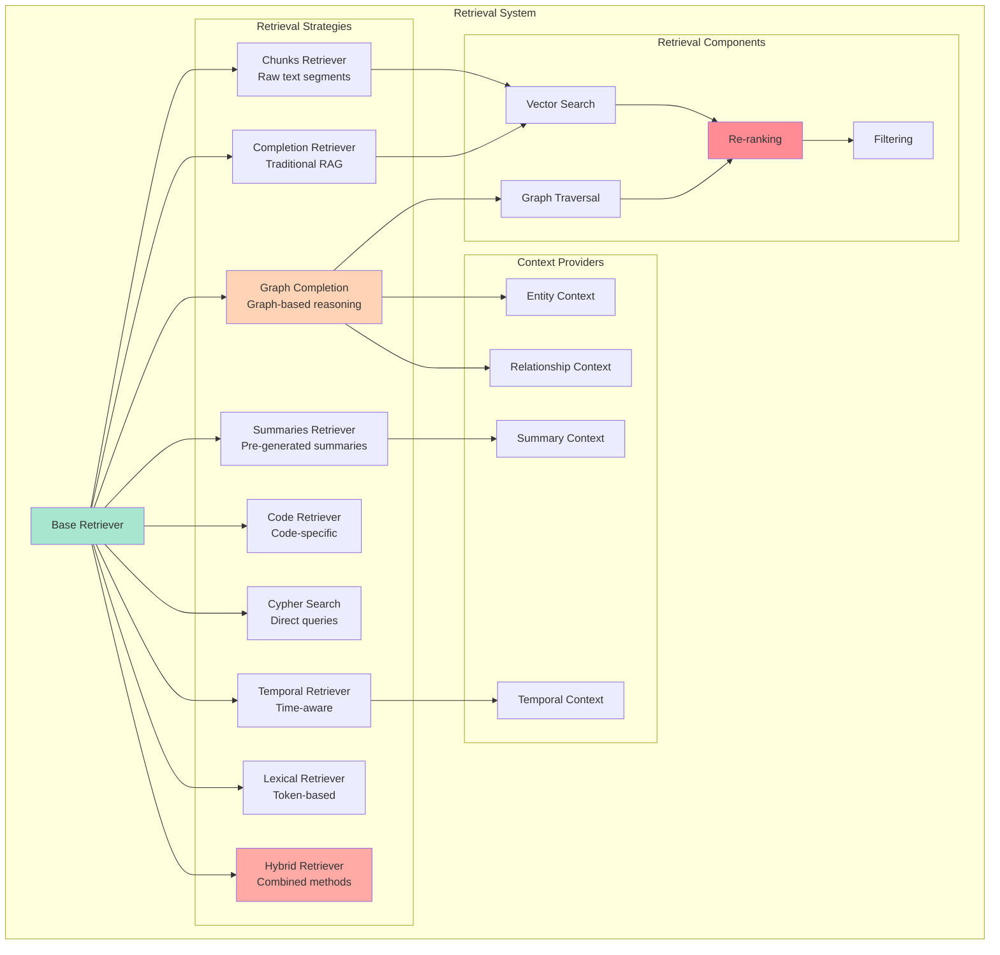

**Description:** The retrieval system provides multiple strategies for information access, from simple chunk retrieval to sophisticated graph-based reasoning, with support for hybrid approaches.

---

## 19. Knowledge Graph Construction

How Cognee builds and maintains knowledge graphs.

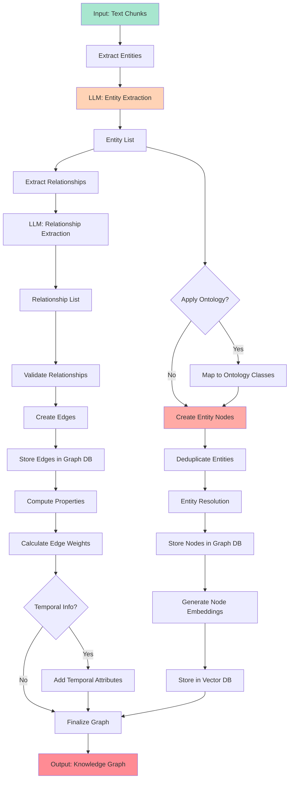

**Description:** Knowledge graph construction involves entity extraction, relationship detection, deduplication, and semantic embedding, creating a rich network of interconnected concepts.

---

## 20. Authentication & Permissions

User authentication and permission management system.

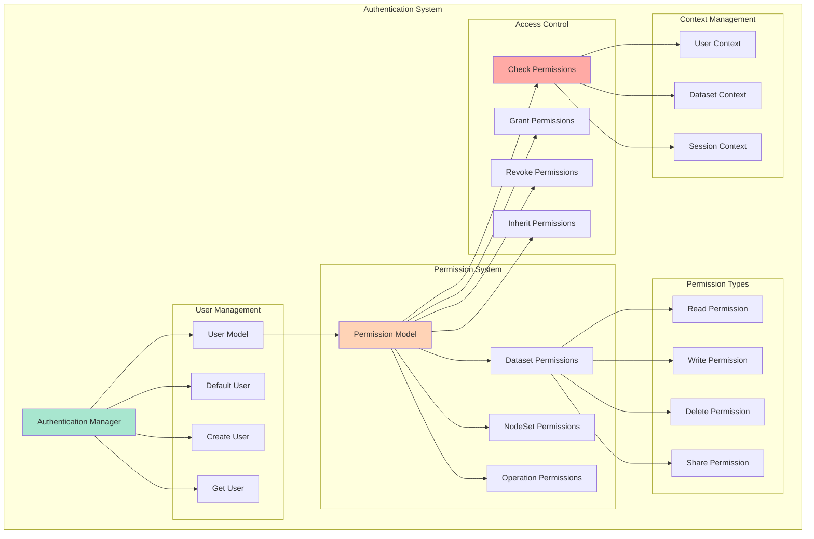

**Description:** The authentication system manages users and permissions, ensuring secure access to datasets and operations. It supports fine-grained permissions and automatic permission inheritance.

---

## 21. Configuration Management

Configuration system for flexibility and customization.

```mermaid
graph TB
    subgraph "Configuration System"
        CONFIG_MGR[Configuration Manager]
        
        subgraph "Configuration Sources"
            ENV_VARS[Environment Variables<br/>.env file]
            CONFIG_FILE[Configuration File<br/>Python config]
            DEFAULTS[Default Values]
            RUNTIME[Runtime Configuration]
        end
        
        subgraph "Configuration Categories"
            LLM_CONFIG[LLM Configuration<br/>API keys, models]
            DB_CONFIG[Database Configuration<br/>Connections, paths]
            STORAGE_CONFIG[Storage Configuration<br/>File systems, S3]
            PIPELINE_CONFIG[Pipeline Configuration<br/>Tasks, batching]
            LOGGING_CONFIG[Logging Configuration<br/>Levels, formats]
        end
        
        subgraph "Configuration APIs"
            GET_CONFIG[Get Configuration]
            SET_CONFIG[Set Configuration]
            VALIDATE_CONFIG[Validate Configuration]
            RESET_CONFIG[Reset Configuration]
        end
        
        subgraph "Configuration Features"
            TYPE_SAFE[Type Safety<br/>Pydantic]
            VALIDATION[Validation Rules]
            SECRETS[Secret Management]
            OVERRIDE[Override Hierarchy]
        end
    end
    
    CONFIG_MGR --> ENV_VARS
    CONFIG_MGR --> CONFIG_FILE
    CONFIG_MGR --> DEFAULTS
    CONFIG_MGR --> RUNTIME
    
    CONFIG_MGR --> LLM_CONFIG
    CONFIG_MGR --> DB_CONFIG
    CONFIG_MGR --> STORAGE_CONFIG
    CONFIG_MGR --> PIPELINE_CONFIG
    CONFIG_MGR --> LOGGING_CONFIG
    
    CONFIG_MGR --> GET_CONFIG
    CONFIG_MGR --> SET_CONFIG
    CONFIG_MGR --> VALIDATE_CONFIG
    CONFIG_MGR --> RESET_CONFIG
    
    SET_CONFIG --> TYPE_SAFE
    SET_CONFIG --> VALIDATION
    GET_CONFIG --> SECRETS
    RUNTIME --> OVERRIDE
    
    style CONFIG_MGR fill:#a8e6cf
    style ENV_VARS fill:#ffd3b6
    style TYPE_SAFE fill:#ffaaa5
```

**Description:** The configuration system uses Pydantic for type-safe settings, supporting multiple configuration sources with a clear override hierarchy and validation rules.

---

## 22. Observability & Monitoring

Monitoring and observability features for production use.

```mermaid
graph TB
    subgraph "Observability System"
        OBS_MGR[Observability Manager]
        
        subgraph "Logging"
            STRUCT_LOG[Structured Logging<br/>structlog]
            LOG_LEVELS[Log Levels<br/>DEBUG to ERROR]
            LOG_FORMAT[Log Formatting]
            LOG_OUTPUT[Log Output<br/>Console, File]
        end
        
        subgraph "Monitoring Tools"
            LANGFUSE[Langfuse Integration<br/>LLM observability]
            CUSTOM_OBS[Custom Observers]
            NONE_OBS[No Monitoring]
        end
        
        subgraph "Metrics"
            PIPELINE_METRICS[Pipeline Metrics<br/>Status, duration]
            LLM_METRICS[LLM Metrics<br/>Tokens, cost]
            DB_METRICS[Database Metrics<br/>Queries, latency]
            MEMORY_METRICS[Memory Metrics<br/>Usage tracking]
        end
        
        subgraph "Tracing"
            PIPELINE_TRACE[Pipeline Tracing]
            TASK_TRACE[Task Execution]
            DB_TRACE[Database Operations]
            LLM_TRACE[LLM Calls]
        end
        
        subgraph "Error Handling"
            ERROR_CAPTURE[Error Capture]
            ERROR_REPORT[Error Reporting]
            RETRY_TRACK[Retry Tracking]
            ALERT[Alerting]
        end
    end
    
    OBS_MGR --> STRUCT_LOG
    OBS_MGR --> LOG_LEVELS
    OBS_MGR --> LOG_FORMAT
    OBS_MGR --> LOG_OUTPUT
    
    OBS_MGR --> LANGFUSE
    OBS_MGR --> CUSTOM_OBS
    OBS_MGR --> NONE_OBS
    
    OBS_MGR --> PIPELINE_METRICS
    OBS_MGR --> LLM_METRICS
    OBS_MGR --> DB_METRICS
    OBS_MGR --> MEMORY_METRICS
    
    OBS_MGR --> PIPELINE_TRACE
    OBS_MGR --> TASK_TRACE
    OBS_MGR --> DB_TRACE
    OBS_MGR --> LLM_TRACE
    
    OBS_MGR --> ERROR_CAPTURE
    OBS_MGR --> ERROR_REPORT
    OBS_MGR --> RETRY_TRACK
    OBS_MGR --> ALERT
    
    LANGFUSE --> LLM_TRACE
    LANGFUSE --> LLM_METRICS
    
    style OBS_MGR fill:#a8e6cf
    style STRUCT_LOG fill:#ffd3b6
    style LANGFUSE fill:#ffaaa5
    style PIPELINE_TRACE fill:#ff8b94
```

**Description:** Comprehensive observability with structured logging, LLM monitoring via Langfuse, performance metrics, and distributed tracing for debugging and optimization.

---

## 23. Deployment Architecture

Different deployment options for Cognee.

```mermaid
graph TB
    subgraph "Deployment Options"
        subgraph "Local Development"
            LOCAL_DEV[Local Python<br/>SQLite + LanceDB + Kuzu]
            LOCAL_DOCKER[Local Docker<br/>Containerized]
        end
        
        subgraph "Self-Hosted Production"
            VM_DEPLOY[VM/Server<br/>PostgreSQL + Vector + Graph DB]
            K8S_DEPLOY[Kubernetes<br/>Scalable pods]
            DOCKER_COMPOSE[Docker Compose<br/>Multi-container]
        end
        
        subgraph "Cloud Platforms"
            AWS_DEPLOY[AWS<br/>EC2, RDS, S3, Neptune]
            AZURE_DEPLOY[Azure<br/>VM, CosmosDB, Blob]
            GCP_DEPLOY[GCP<br/>Compute, Cloud SQL, Storage]
            MODAL_DEPLOY[Modal<br/>Serverless Python]
        end
        
        subgraph "Hosted Platform"
            COGWIT[Cogwit Platform<br/>Managed Service]
        end
        
        subgraph "Storage Backends"
            LOCAL_STORAGE[Local File System]
            S3_STORAGE[AWS S3]
            AZURE_STORAGE[Azure Blob]
            GCS_STORAGE[Google Cloud Storage]
        end
        
        subgraph "Database Options"
            EMBEDDED[Embedded DBs<br/>SQLite, Kuzu, LanceDB]
            MANAGED[Managed DBs<br/>RDS, Neo4j Cloud, Qdrant Cloud]
            SELF_MANAGED[Self-Managed<br/>PostgreSQL, Neo4j, etc.]
        end
    end
    
    LOCAL_DEV --> LOCAL_STORAGE
    LOCAL_DEV --> EMBEDDED
    
    VM_DEPLOY --> LOCAL_STORAGE
    VM_DEPLOY --> SELF_MANAGED
    
    K8S_DEPLOY --> S3_STORAGE
    K8S_DEPLOY --> MANAGED
    
    AWS_DEPLOY --> S3_STORAGE
    AWS_DEPLOY --> MANAGED
    
    AZURE_DEPLOY --> AZURE_STORAGE
    GCP_DEPLOY --> GCS_STORAGE
    
    MODAL_DEPLOY --> S3_STORAGE
    MODAL_DEPLOY --> MANAGED
    
    COGWIT --> S3_STORAGE
    COGWIT --> MANAGED
    
    style LOCAL_DEV fill:#a8e6cf
    style K8S_DEPLOY fill:#ffd3b6
    style COGWIT fill:#ffaaa5
    style MODAL_DEPLOY fill:#ff8b94
```

**Description:** Cognee supports multiple deployment scenarios from local development to cloud-native architectures, with flexible storage and database backends for different scale requirements.

---

## Summary

This architecture documentation provides comprehensive visualizations of the Cognee system:

- **High-Level**: Shows the overall system design and main components
- **Processing Flow**: Details the ECL pipeline and data transformations
- **Infrastructure**: Explains the multi-database architecture and provider integrations
- **Modules**: Breaks down the codebase organization and dependencies
- **Operations**: Illustrates each major operation (add, cognify, memify, search)
- **Deployment**: Covers various deployment options and configurations

The diagrams use consistent color coding:
- 🟢 Green (`#a8e6cf`) - Starting points and main components
- 🟠 Orange (`#ffd3b6`) - Processing and transformation steps
- 🔴 Red (`#ffaaa5`) - Advanced features and specialized components
- 🟥 Dark Red (`#ff8b94`) - End points and results

For more information, see:
- [README.md](README.md) - Project overview and quick start
- [CONTRIBUTING.md](CONTRIBUTING.md) - Development guidelines
- [Documentation](https://docs.cognee.ai) - Comprehensive online docs
